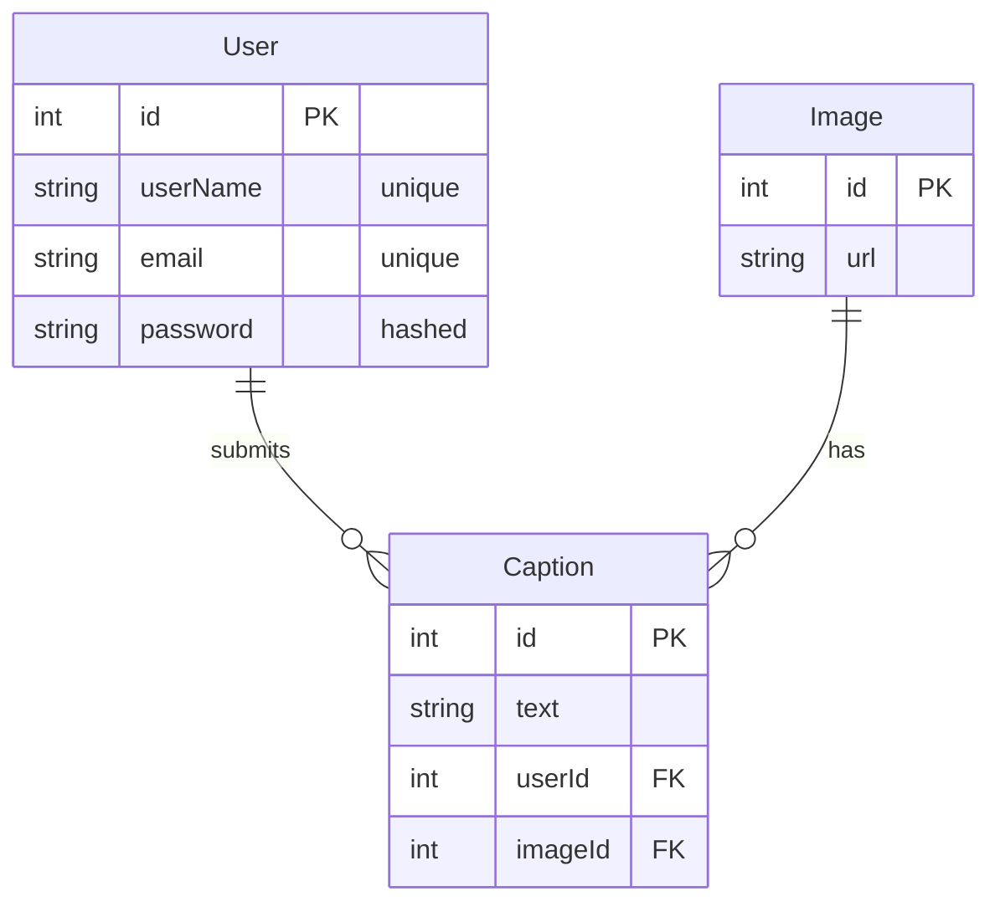

# Photo Caption Contest

This is my adaptation of the Codecademy Project - [see here](https://www.codecademy.com/journeys/back-end-engineer/paths/becj-22-security-infrastructure-scalibility/tracks/becj-22-portfolio-project-photo-caption-contest/modules/becp-22-photo-caption-contest-e59b30e6-216a-4b4e-8618-38b2556b8522/kanban_projects/ext-proj-caption-contest). The Project's requirements are documented [here](./project_requirements.md).

## Project Overview

A full-stack web app that hosts a collection of images. Authenticated users can submit creative captions. It also features:

- user authentication
- session management
- RESTful API endpoints
- interactive web views
- database persistence with PostgreSQL
- performance optimization through localized caching

---

## Architecture & Design

## Database Schema

### Entities & Relationships



---

## API Endpoints

### JSON API (`/api/*`)

| Method | Endpoint                   | Auth Required | Description                                     |
| ------ | -------------------------- | ------------- | ----------------------------------------------- |
| GET    | `/api/images`              | No            | Retrieve all images with captions and user data |
| GET    | `/api/images/:id`          | No            | Get specific image with all captions            |
| POST   | `/api/images/:id/captions` | Yes           | Submit a caption for an image                   |

### Web Views

| Method | Route                  | Description                  |
| ------ | ---------------------- | ---------------------------- |
| GET    | `/`                    | Home page with image gallery |
| GET    | `/images/:id`          | Single image detail page     |
| POST   | `/images/:id/captions` | Submit caption (HTML form)   |
| GET    | `/register`            | Registration form            |
| POST   | `/register`            | Process registration         |
| GET    | `/login`               | Login form                   |
| POST   | `/login`               | Process login                |
| POST   | `/logout`              | End session                  |

### Documentation

| Route       | Description                                        |
| ----------- | -------------------------------------------------- |
| `/api-docs` | Interactive Swagger UI with full API documentation |

---

## Setup & Installation

### Prerequisites

- Node.js (v16+)
- PostgreSQL (v12+)
- npm

### Installation Steps

1. **Clone the repository**

2. **Install dependencies**

   ```bash
   npm install
   ```

3. **Configure environment variables**

   Create a `.env` file in the project root

   ```env
   USERNAME=your_postgres_username
   PASSWORD=your_postgres_password
   DATABASE=your_database_name
   SESSION_SECRET=your_random_secret_key
   ```

4. **Create PostgreSQL database**

   ```bash
   psql -U postgres
   CREATE DATABASE your_database_name;
   ```

5. **Build the application**

   ```bash
   npm run build
   ```

6. **Start the server**

   ```bash
   npm start
   ```

   For development with auto-recompilation:

   ```bash
   npm run dev:watch
   ```

7. **Access the application**
   - Web Interface: `http://localhost:3000`
   - API Documentation: `http://localhost:3000/api-docs`

---

## What Happens on Launch

When you run `npm start`, the application executes the following initialization sequence:

### 1. Environment Configuration

- Loads environment variables from `.env` file
- Configures TypeORM DataSource with PostgreSQL connection details

### 2. Express Server Initialization

- Sets up EJS as the view engine with layout support
- Configures middleware stack:
  - JSON and URL-encoded body parsing
  - Static file serving from `/public`
  - Session management with secure cookies
  - Session data injection into view locals

### 3. Route Registration

- Mounts view routes at `/`
- Mounts API routes at `/api`
- Mounts auth routes at `/` (register, login, logout)
- Serves Swagger documentation at `/api-docs`

### 4. Database Connection

- Establishes connection to PostgreSQL via TypeORM
- Creates tables if they don't exist (synchronize: true)
- Initializes TypeORM repositories for User, Image, and Caption entities

### 5. Database Seeding

- Checks if Image table is empty
- If empty, seeds 5 initial images from external URLs
- Skips seeding if images already exist

### 6. Server Start

- Binds to port 3000 (or PORT environment variable)
- Logs confirmation message: `Server running on http://localhost:3000`
- Application is ready to accept requests

---
